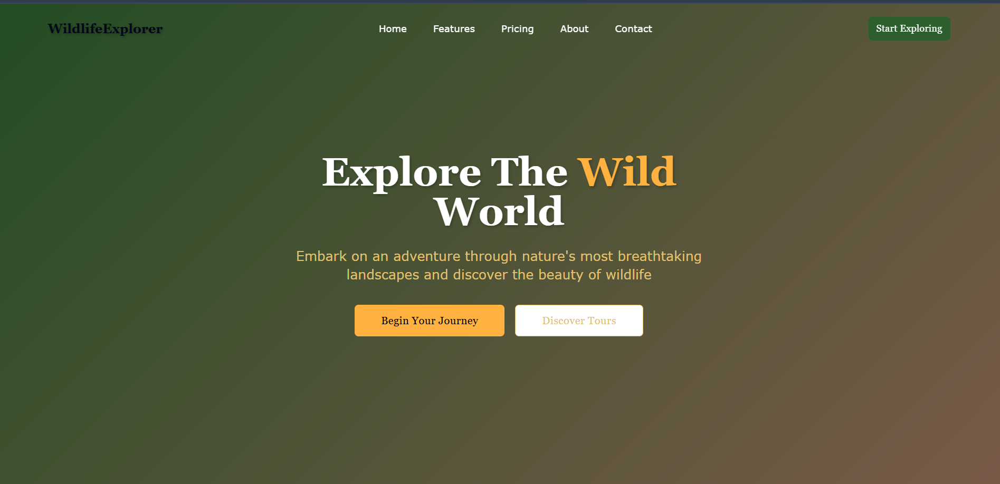

🌿 GeoWild 🌍

 ✨ Overview

 **GeoWild** is a visually immersive wildlife photo gallery built using modern frontend tools. Designed for responsiveness, animation, and performance.

 🔥 Features

- 🖼️ Elegant masonry-style photo grid
- 📱 Fully responsive and mobile-first design
- 🌀 Smooth page transitions using **Framer Motion**
- ⚛️ Built with **React + TypeScript**
- 🌈 Styled with **Tailwind CSS** and reusable UI
- 🔁 Modular architecture for scalability
- 🎯 SEO-optimized with customizable meta tags
- 🧪 Ready for unit testing

 📦 Tech Stack

| Category       | Tech                            |
| -------------- | ------------------------------- |
| 🚀 Framework   | [React](https://reactjs.org/)   |
| 🎨 Styling     | [Tailwind CSS](https://tailwindcss.com/) |
| 🎞️ Animation  | [Framer Motion](https://www.framer.com/motion/) |
| 🧰 Utilities   | TypeScript, Vite, shadcn/ui, Lucide Icons |
| 📷 Assets      | `public/images/` wildlife collection |

🚀 Getting Started

 🛠 Requirements

Node.js >= 16
npm or yarn

📥 Installation

 1. Clone the repository
git clone https://github.com/Nireekshith25/GeoWild.git
cd GeoWild

 2. Install dependencies
npm install

3. Start the development server
npm run dev

 App is running at http://localhost:5173

